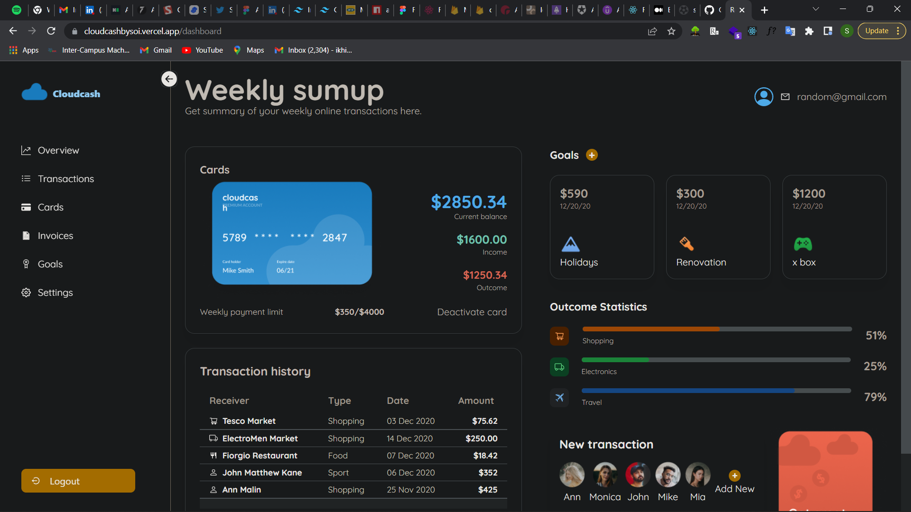

# Onose's Love Calculator

This is a love calculator application built using react.js, and tailwindCSS.

## Table of contents

- [Overview](#overview)
  - [Screenshot](#screenshot)
  - [Links](#links)
  - [Built with](#built-with)
  - [What I learned](#what-i-learned)
- [Author](#author)

## Overview

This is a love calculator that I built using react.js, and tailwindCSS. It allows for users to be able to
enter two names: the first being their name, and the second being the name of their crush or supposed lover,
and then on clicking the "calculator icon", the application would calculate the love percentage between the
two individuals, and return a value, with a message.

### Screenshot

### Links

- Solution URL: (https://github.com/Generalsoi/loveCalculator)
- Live Site URL: (https://onose-love-calculator.netlify.app/)

### Built with

- Tailwind CSS
- [React](https://reactjs.org/) - JS library
- React router v6

### What I learned

I learned about how to persist state using localStorage, and I also learned how to handle caching properly.

It was a beautiful project to work on.

## Author

- Website - [Success Ikhinobele](https://www.github.com/Generalsoi)
- Twitter - [@Successsoi1](https://www.twitter.com/Successsoi1)
